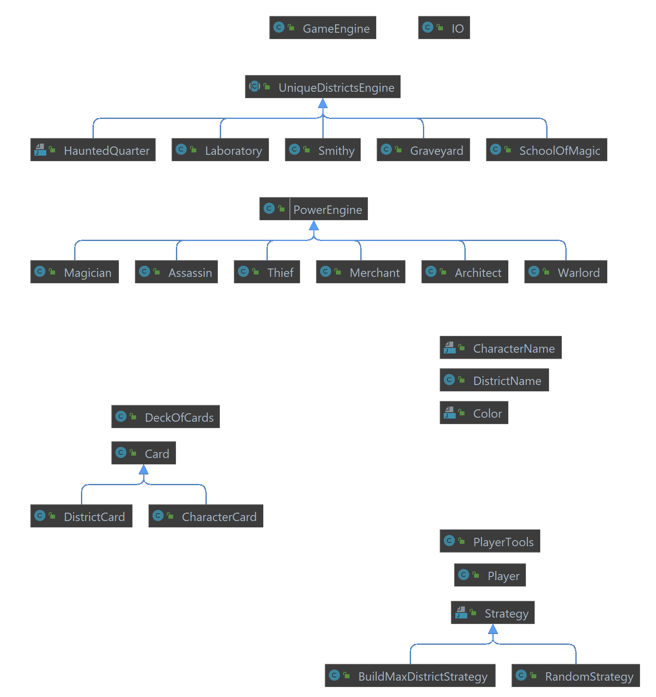

# Rapport - KX-B

### 1. Comment est faite l'architecture du projet ? Et quels choix vous ont amené à la réaliser ainsi ?

On a choisi de s’inspirer le plus possible de la réalité quand on a numérisé ce jeu de plateau, en effet il y a un maitre de jeu qui fait toutes les vérifications et les appels aux autres objets.

Le joueur possède des cartes, des pièces et a une stratégie qui peut changer ou non. Enfin, on évite un maximum les chaines de caractère, on privilégie les types énumérés pour éviter les erreurs dans le code.

Le projet est entièrement codé en anglais

### 2. Où trouver les infos dans la doc ?

  Pour la documentation nous avons beaucoup utilisé le site http://jeuxstrategie.free.fr/Citadelles_complet.php , pour toutes les informations du jeu.  Chaque méthode à un nom explicite ce qui permet une meilleure lisibilité

### 3. Qui est responsable de quoi / qui a fait quoi ?

Nous avons divisé le travail afin de pouvoir tous toucher aux différentes parties du codes en passant du Game Engine, aux cartes ainsi qu’aux tests. L’avantage étant que toute l’équipe a une vision globale du code qu’elle conçoit, la partie négative est que la répartition du travail nous prend plus de temps.

Pour plus de détail voir : https://github.com/pns-si3-projects/projet2-ps5-21-22-ps5-21-22-projet2-b

### 4. Quel est le process de l'équipe ? (Comment git est utilisé, …)

Nous rédigeons au début de la séance 1 ou 2 Milestone avec les issues correspondantes, Une fois cela fait chacun part de son côté et réalise les issues qui lui ont été assigné, on développe chacun sur nos branches respectives afin de s’isoler de l’espace de travail principal. Une fois le code et les tests finis et sont passés on merge nos changements sur master, et on recommence le processus.

Chaque commit de code dans la branche « main » doit pouvoir ajouter des fonctionnalités tout en gardant le jeu jouable du début à la fin. Un « code coverage » de 100% du nouveau code ajouté est aussi requis. Seule la méthode launchgame() du GameEngine n’est pas testée car elle n’est pas testable unitairement. 

### 5. Avancement sur les fonctionnalités (quelles slices sont faites ? lesquelles restent à faire ?)

*Pour un tour de jeu :*

 - On peut avoir jusqu’à 7 joueurs
 - Le sens de la pioche des personnages est défini en fonction du joueur qui avait pioché le Roi lors du tour précédent.
 - Les joueurs choisissent leurs personnages en fonction d’une stratégie.
 - Les joueurs sont appelés en fonction de l’ordre de leur personnage.

*Pour un tour de joueur :*

 - Utiliser le pouvoir du personnage choisit
 - Utiliser le pouvoir du personnage choisit
 - Choisir entre pièces et des cartes
 - Construire un quartier (s’il possède suffisamment de pièces)
Récolter des impôts si possibles.

*Pour une fin de partie :*

- Si un des joueurs a construit les 8 quartiers, alors c’est le dernier tour de la partie.
- Les points sont calculés en fonction du prix des bâtiments construits.
- Le classement des joueurs est affiché par ordre décroissant.
 
 
### 6. Etat de la base de code : quelles parties sont bien faites ? Quelles parties sont à refactor et pourquoi ?

**Les parties bien faites** : 

- Gestion des cartes district
- Utilisation de type énuméré et non pas de string
- Séparation des méthodes *communes* du player dans une classe dédiée
- Le squelette de la stratégie
- Classe dédiée a l’entrée sortie

**Les parties à refactor**:

- Les parties stratégies sont à refactor car elles ne prennent pas encore en compte le reste du jeu (exemple ne prends pas en compte les autres joueurs dans la stratégie)
- implémentation des personnages
- Faire des ramifications de stratégies, une partie pour le choix et l'utilisation des rôles, une partie pour la construction des quartiers, une partie pour la construction des merveilles
- Stratégies prédéfinies, complètement déterministe

### 7. Architecture du projet 

## Auteurs

- [@FlorianLatapie](https://github.com/FlorianLatapie)
- [@ThomasPaul](https://github.com/tom3883)
- [@LoicLeBris](https://github.com/LoicLeBris)
- [@MariusLesaulnier](https://github.com/MariusLesaulnier)
